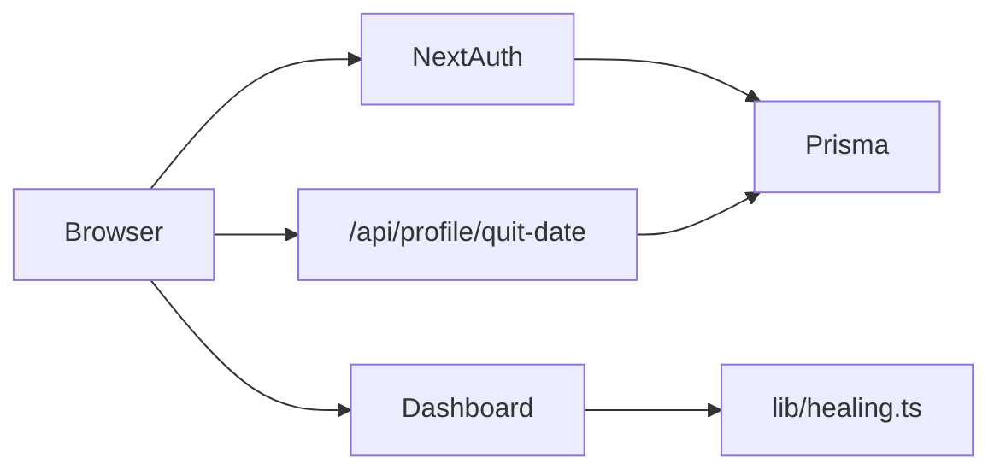

# Архитектура

## Стек

- **Next.js 15.5** (App Router) — UI и API routes
- **NextAuth v4** (Credentials) — сессии JWT, email + пароль; API route `runtime: nodejs`
- **Prisma + PostgreSQL** — пользователи, `quitDate`, `RelapseEvent` (прод: Railway; локально: Docker Postgres или та же БД)
- **CSS** — один `globals.css`, без inline-стилей
- **Шрифты** (Google via `layout.tsx`): **Inter** — UI; **Anton** — счётчик, заголовки, stats; **IBM Plex Mono** — таймер emergency
- **Фон** — tiers `full` / `lite` / `static` ([`motion-profile.ts`](../src/lib/motion-profile.ts), [`BackgroundEffects.tsx`](../src/components/BackgroundEffects.tsx))

## Поток данных

## Страницы

| Путь | Назначение |
|------|------------|
| `/` | Dashboard (требует сессию) |
| `/login`, `/register` | Авторизация |
| `/api/register` | Создание пользователя |
| `/api/auth/*` | NextAuth |
| `/api/profile` | GET/PATCH профиля (дата, привычки, валюта) |
| `/api/profile/quit-date` | Устаревший alias (можно использовать `/api/profile`) |
| `/api/relapse` | GET — последние срывы; POST — записать срыв (опциональная заметка) |

## Фон и дым

- Чёрный фон: `.app-shell::before` (`--color-bg`), без `bg-smoke.png`.
- Анимация: `BackgroundEffects` — Canvas 2D (`src/lib/smoke-canvas.ts`), мягкие wisps, `z-index: 2` (над фоном, под контентом `z-index: 3`).
- Декор: `CigaretteAccent` в углу, отдельно от фонового дыма.

## Деплой

- **Vercel** — Next.js; сборка: `prisma migrate deploy` + `next build` (`vercel.json`)
- **Railway** — PostgreSQL, `DATABASE_URL` в Vercel
- Подробно: [deploy-railway-vercel.md](deploy-railway-vercel.md)

## Расширение

- OAuth: добавить провайдер в `src/lib/auth.ts`
- Аналитика тяги: отдельная таблица при открытии emergency (срывы уже в `RelapseEvent`)
