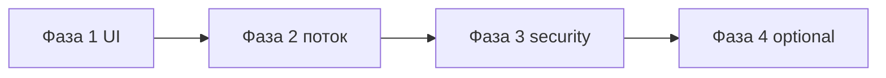

# План улучшения логина и регистрации

Текущее состояние: email + пароль (NextAuth Credentials), страницы `/login` и `/register`, общий `AuthForm`, карточка `.auth-card` на чёрном фоне без брендинга как на dashboard.

## Цели

1. Визуальная связность с главным экраном (дым, glass, glitch-логотип).
2. Меньше трения при первом входе и понятные ошибки.
3. Безопасность и готовность к продакшену (rate limit, валидация, опционально OAuth позже).

---

## Фаза 1 — UI/UX (быстрые победы)

| Задача | Детали |
|--------|--------|
| Брендинг на auth | `GlitchTitle` (FUCK / SMOKE) над формой; тот же `BackgroundEffects` через `Providers` (уже есть на shell). |
| Glass-форма | Расширить `.auth-card`: прозрачность как у dashboard-модулей, без «серой коробки». |
| Ошибки | Текст ошибки под полем + `role="alert"`; i18n EN/PL для кодов (`invalid credentials`, `email taken`, сеть). |
| Состояния кнопки | Loading: disabled + label «Please wait…»; не двойной submit. |
| Переключение login ↔ register | Заметная ссылка; сохранить email при переходе (query или sessionStorage). |
| Поля | `autocomplete`, `type="email"`, показ/скрытие пароля (иконка), минимальная длина пароля в hint. |

**Критерий готовности:** новый пользователь за 30 с понимает, что делать; ошибки читаются без DevTools.

---

## Фаза 2 — Поток после регистрации

| Задача | Детали |
|--------|--------|
| Единый онбординг | После register → login → `ProfileOnboarding` (уже есть); не дублировать дату на register. |
| Redirect | `callbackUrl` после login; защита `/` без сессии (уже через middleware или page check — сверить). |
| Remember UX | Опционально «Stay signed in» (NextAuth `maxAge` / refresh — документировать в env). |

---

## Фаза 3 — Безопасность и надёжность

| Задача | Детали |
|--------|--------|
| Валидация API | Zod на `/api/register`: email format, password ≥ 8, trim lowercase email. |
| Rate limiting | Vercel middleware или Upstash: лимит на register/login IP (например 10/15 min). |
| Пароли | bcrypt cost проверить; сообщение не раскрывать «email exists» vs «wrong password» (один текст login). |
| HTTPS / cookies | `NEXTAUTH_URL` в проде; secure cookies (Vercel по умолчанию). |

---

## Фаза 4 — Расширения (по приоритету клиента)

| Задача | Детали |
|--------|--------|
| Forgot password | Токен в БД + email (Resend/SMTP); страница reset. |
| Email verify | Опционально перед полным доступом. |
| OAuth | Google/Apple через NextAuth — отдельная миграция с Auth.js v5. |
| Privacy / Terms | Ссылки в footer auth + checkbox при register (GDPR). |

---

## Порядок внедрения (рекомендуемый)

1. **Спринт 1:** Фаза 1 (1–2 дня).
2. **Спринт 2:** Фаза 2 + часть Фазы 3 (валидация API, rate limit).
3. **Бэклог:** Фаза 4 по запросу.

---

## Файлы для правок (Фаза 1)

- `src/components/AuthForm.tsx`
- `src/app/login/page.tsx`, `src/app/register/page.tsx`
- `src/app/globals.css` (`.auth-card`, `.auth-shell`)
- `src/i18n/locales/en.ts`, `pl.ts`
- Опционально: `src/components/GlitchTitle.tsx` на auth layout

## Связанные документы

- [architecture.md](architecture.md) — NextAuth, Prisma
- [deploy-railway-vercel.md](deploy-railway-vercel.md) — `NEXTAUTH_*`
- [env-variables.md](env-variables.md)
